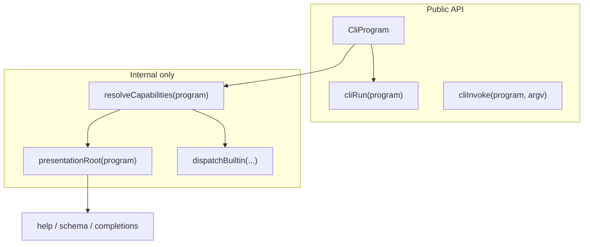

# CliProgram + internal capabilities (2.0)

## Goals

- **Types**: `CliNode` (user tree) + `CliProgram` (what `cliRun` accepts) with root-only `mcpServer` / `install` only on `CliProgram`.
- **Capabilities**: One internal resolver drives reserved names, help/schema/completion visibility, and dispatch guards.
- **Exports**: Minimal public surface — no `resolveCapabilities`, no presentation helpers, no builtin command builders.
- **Breaking**: Drop `CliCommand` from the public API — ship **2.0.0 directly** (Option B; no deprecated alias release).

## Type model

Add to [`src/types.ts`](src/types.ts):

```typescript
interface CliNodeBase { key; description; notes?; options? }

type CliLeaf = CliNodeBase & { handler; positionals?; mcpTool? }
type CliRouter = CliNodeBase & { commands: CliNode[]; fallbackCommand?; fallbackMode? }
type CliNode = CliLeaf | CliRouter

type CliProgram = CliNode & { mcpServer?; install? }
```

Remove `mcpServer`, `install`, `mcpTool` from a shared `CliCommandBase`. Remove the old `CliCommand` union entirely **inside the repo**.

**Leaf program roots** (`examples/minimal.ts`) remain valid: `CliProgram` = leaf + root config.



## Export policy (intentionally narrow)

### Export from [`src/index.ts`](src/index.ts) only

| Symbol | Action |
|--------|--------|
| `CliProgram` | **Add** — primary schema type |
| `CliCommand` | **Remove** — breaking |
| `CliNode`, `CliLeaf`, `CliRouter` | **Do not export** — authors use `satisfies CliProgram` or `typeof program.commands[n]` |
| `CliOption`, `CliPositional`, config types | unchanged |
| `cliRun`, `cliInvoke`, `CliContext`, enums | unchanged signatures, `CliProgram` param |

Run `just typegen` so [`index.d.ts`](index.d.ts) reflects only the barrel.

### Keep internal (not in barrel, no deep `package.json` exports)

- [`src/capabilities.ts`](src/capabilities.ts) (new): `resolveCapabilities`, `reservedCommandNames`
- [`src/builtins/presentation.ts`](src/builtins/presentation.ts), [`export.ts`](src/builtins/export.ts), [`dispatch.ts`](src/builtins/dispatch.ts)
- Completion emitters, install module, `setCompiledExecutableOverride`
- [`src/completion.ts`](src/completion.ts) shim — trim re-exports if any leak toward public paths; tests import from `builtins/` or `completion.ts` directly in-repo only

**Rule**: If it decides *when* a builtin appears, it stays internal. Consumers only see the resulting CLI behavior.

## Internal capabilities module

New [`src/capabilities.ts`](src/capabilities.ts):

```typescript
interface CliCapabilities {
  completion: true;
  mcp: boolean;      // !!program.mcpServer
  install: boolean;  // isCompiledExecutable() && program.install?.enabled !== false
}

function resolveCapabilities(program: CliProgram): CliCapabilities
function reservedCommandNames(caps: CliCapabilities): string[]
```

Wire callers to use this instead of re-deriving:

| File | Change |
|------|--------|
| [`src/validate.ts`](src/validate.ts) | `cliValidateProgram(program)`; reserved names from `caps`; **keep** runtime root-only checks for untyped/JS abuse |
| [`src/builtins/presentation.ts`](src/builtins/presentation.ts) | `presentationBuiltins(program, caps)` |
| [`src/builtins/export.ts`](src/builtins/export.ts) | same |
| [`src/builtins/dispatch.ts`](src/builtins/dispatch.ts) | derive `caps` once from `program` |
| [`src/runtime.ts`](src/runtime.ts) | `cliRun(program: CliProgram)` |

Walkers (`parse`, `mcp/tools`, completion scopes) take `CliNode` where they recurse; entrypoints take `CliProgram`.

**Presentation vs user tree**: Help, `--schema`, and completion emitters consume `cliPresentationRoot(program)` (synthetic router with builtin stubs), not raw `CliProgram`. Capability logic decides what gets injected; emitters keep walking the same presentation shape.

**Validate edge cases** (keep at runtime even when TS catches most mistakes):

- `mcpServer` / `install` on inner nodes — reject (untyped/JS abuse)
- `mcpTool` on program root (leaf-shaped `CliProgram`) — reject (same as today)
- Reserved command names from `reservedCommandNames(caps)` — drop the old `cliPresentationRoot` escape hatch that skips injection when user already declared `completion`

## Context typing

[`src/context.ts`](src/context.ts):

- Change `ctx.schema` type to `CliProgram` (field name unchanged — avoids extra public surface).
- **Nice-to-have**: add `get program(): CliProgram` alias returning `this.schema` with JSDoc pointing to `schema` for familiarity. Do **not** export a new type for this.

## Consumer migration (2.0)

### Before/after (representative of qa-cli, idp-trees, and all `: CliCommand`-typed consumers)

```typescript
// Before (1.x)
import { cliRun, type CliCommand, CliOptionKind, CliFallbackMode } from "argsbarg";
const cli: CliCommand = { key: 'myapp', commands: [...], mcpServer: {...} };
await cliRun(cli);

// After (2.0)
import { cliRun, type CliProgram, CliOptionKind, CliFallbackMode } from "argsbarg";
const cli = { key: 'myapp', commands: [...], mcpServer: {...} } satisfies CliProgram;
await cliRun(cli);
```

No structural change for well-formed apps — only import + type annotation. `: CliProgram` also works if the consumer prefers explicit annotation over `satisfies`. Both patterns are supported and type-check identically.

### Consumer impact (verified)

| Consumer | Files importing argsbarg | Uses `CliCommand`? | Uses `mcpServer`/`install`? | Migration cost |
|---|---|---|---|---|
| qa-cli | 3 (`index.tsx`, `mcpConfig.ts`, `mcp.ts`) | `const cli: CliCommand` | `mcpServer` on root | Replace `CliCommand` → `CliProgram` in 1 import, 1 annotation |
| idp-trees | 3 (`index.tsx`, `mcp/config.ts`, `headless/mode.ts`) | `const cli: CliCommand` | `mcpServer` on root | Replace `CliCommand` → `CliProgram` in 1 import, 1 annotation |

Both consumers only use `CliCommand` for the root schema annotation. Neither imports `CliNode`/`CliLeaf`/`CliRouter` (they can't — they don't exist yet). Neither has deeply nested command trees (max depth 2). All other imported types (`CliOptionKind`, `CliFallbackMode`, `CliMcpServerConfig`, `CliMcpToolConfig`, `CliInvocation`, `CliContext`, `isInteractiveTty`) remain unchanged — those files need zero changes.

### `install` builtin default behavior

Both qa-cli and idp-trees rely on the `install` builtin being **enabled by default** (they do not set `install` on the root). The capabilities resolver must preserve this: `install: isCompiledExecutable() && program.install?.enabled !== false` — which defaults to enabled when `install` is absent.

## Tests and negative cases

- Update fixtures in [`src/index.test.ts`](src/index.test.ts), [`src/builtins/builtins.test.ts`](src/builtins/builtins.test.ts), [`src/install/install.test.ts`](src/install/install.test.ts): `CliProgram` / `CliNode` internally.
- Runtime rejection tests (`mcpServer` on nested node) use `as unknown as CliProgram` or a small `invalidProgram()` helper — proves validate still catches misuse without TS.

## Docs and changelog

- [`README.md`](README.md): `CliProgram`, capabilities mental model (1 short paragraph), reserved names derived from config.
- [`CHANGELOG.md`](CHANGELOG.md): **2.0.0** — `CliCommand` removed; `CliProgram` added; show before/after migration snippet. Include a note that structural schema shape is unchanged — only the type name and annotation pattern differ.
- Optional short **Architecture** note in README (not a new doc file unless you want one).

### 2.0.0 migration snippet (for CHANGELOG)

```typescript
// 1.x
import { type CliCommand } from "argsbarg";
const cli: CliCommand = { ... };
// 2.0
import { type CliProgram } from "argsbarg";
const cli = { ... } satisfies CliProgram;  // or : CliProgram
```

## Version and release

**2.0.0** — rename-only breaking change for typed consumers; runtime behavior unchanged.

**Release path (chosen): Option B** — jump straight to 2.0.0. No `CliCommand` deprecated alias in 1.6. Breaking changes are acceptable; known consumers (qa-cli, idp-trees) migrate in one import + one annotation each.

### Pre-release checklist (required before tag)

1. `just test` green in argsbarg
2. `just typegen` — `index.d.ts` exports `CliProgram` only (no `CliCommand`)
3. Point qa-cli and idp-trees `package.json` at local argsbarg checkout; confirm `tsc` / build passes with `CliProgram` migration applied in those repos
4. CHANGELOG 2.0.0 entry with migration snippet

---

## Nice-to-haves (defer if time-boxed)

1. **`satisfies CliProgram`** in all examples (better DX than `: CliProgram` annotation). Verify that `satisfies` still infers precise sub-command types (not widening to `object`), particularly in nested structures like `examples/nested.ts`.
2. **`ctx.program` getter** — alias for `ctx.schema`; document `schema` as legacy name in JSDoc only (no removal in 2.0).
3. **Internal rename** `cliValidateRoot` → `cliValidateProgram` (not exported today; safe).
4. **Type tests** in `src/types.test.ts` — compile-only assertions that invalid shapes fail (e.g. `mcpServer` on `CliNode`) using `@ts-expect-error` snippets.
5. **README diagram** — small mermaid of user tree vs injected capabilities (documentation only).

## Explicitly out of scope (avoid future breaks)

- Exporting `CliCapabilities`, `resolveCapabilities`, `presentationRoot`, builtin command builders
- Exporting `CliNode` / `CliLeaf` / `CliRouter` (can add in 2.x if demand appears; not needed for `nested.ts`-style apps)
- `package.json` subpath exports (`argsbarg/builtins`, etc.)
- Renaming `ctx.schema` in 2.0 (would break handlers that read `.schema`)
