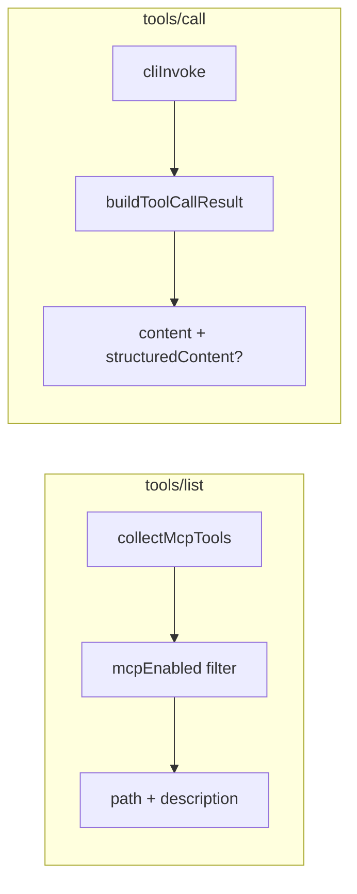

# MCP follow-up improvements plan

Four targeted enhancements to the existing opt-in MCP server. No new dependencies, no protocol transport changes, no public export of internals beyond the new `mcpEnabled` schema field.



---

## 1. CLI path in tool descriptions

**Goal:** Agents see the human invocation path without reading the schema resource first.

**Format:**

| Path | Leaf description | MCP `description` |
| --- | --- | --- |
| `["stat","owner","lookup"]` | `Resolve owner info.` | `stat owner lookup — Resolve owner info.` |
| `["read"]` | `Print the first line…` | `read — Print the first line…` |
| `[]` (root leaf app) | `Tiny demo.` | `{root.key} — Tiny demo.` |

Use em dash (`—`) between path and description. Path segments are raw `key` values (not sanitized tool names). Every tool description uses the `prefix — description` form — there is no bare-description fallback.

**Implementation:**

- Add helper in [`src/mcp/tools.ts`](src/mcp/tools.ts). The helper **must** receive `rootKey` so root-leaf apps (empty path) can use the program name as the prefix:

```typescript
/** Builds MCP tool description: "{cli path} — {description}". */
function mcpToolDescription(path: string[], rootKey: string, description: string): string {
  const prefix = path.length > 0 ? path.join(" ") : rootKey;
  return `${prefix} — ${description}`;
}
```

- Call from `collectMcpTools` when building each `McpToolDef.description`:

```typescript
description: mcpToolDescription(path, root.key, cmd.description),
```

- `tools/list` already maps `t.description` — no server change needed.

**Tests:** Update [`src/index.test.ts`](src/index.test.ts):

- `stat_owner_lookup` description is `stat owner lookup — Resolve owner info.`
- If testing a root-leaf fixture, description is `{root.key} — {description}`.

---

## 2. Per-leaf opt-out via `mcpEnabled`

**Goal:** Authors can keep CLI commands for humans while hiding them from MCP tool discovery.

**Schema change** in [`src/types.ts`](src/types.ts):

```typescript
export interface CliCommandBase {
  // ...existing fields...
  /** Leaf-only. When `false`, omit this command from MCP tools (default: exposed). */
  mcpEnabled?: boolean;
}
```

**Semantics:**

- Omitted or `true` → leaf is exposed (current behavior).
- `false` → skipped in `collectMcpTools` walk.
- Root `mcp?: CliMcpConfig` unchanged — it enables the server; `mcpEnabled` is unrelated.

**Validation** in [`src/validate.ts`](src/validate.ts) `walkCommand`:

- If `isRoot && cmd.mcpEnabled !== undefined` → throw `mcpEnabled is only supported on leaf commands`.
- If routing node (has `commands`, no `handler`) and `mcpEnabled !== undefined` → same error.
- No validation needed for `false` vs `true` beyond that.

**Tool collection** in [`src/mcp/tools.ts`](src/mcp/tools.ts) `walk`:

```typescript
if ("handler" in cmd && cmd.handler) {
  if (cmd.key === "completion" || cmd.key === "mcp") return;
  if (cmd.mcpEnabled === false) return;
  // push tool...
}
```

**Schema export:** Leave [`src/schema.ts`](src/schema.ts) unchanged for v1 — `--schema` still lists all commands (CLI discovery). Only MCP `tools/list` respects `mcpEnabled`. Document this distinction in [`docs/mcp.md`](docs/mcp.md).

**Example (optional):** Add a hidden leaf in `nestedMcpFixture` only (not `examples/nested.ts`) with `mcpEnabled: false` to prove filtering without cluttering the demo app.

---

## 3. stderr on successful tool calls

**Goal:** Warnings and diagnostic output on stderr are not silently dropped when `exitCode === 0`.

**Current behavior** ([`src/mcp/server.ts`](src/mcp/server.ts) ~L133–141): success returns only `invokeResult.stdout`.

**New behavior:** Extract a small builder (new file [`src/mcp/result.ts`](src/mcp/result.ts) recommended to keep server readable):

```typescript
export interface McpToolCallSuccess {
  content: { type: "text"; text: string }[];
  structuredContent?: unknown;
  isError: false;
}

export function buildToolCallSuccess(stdout: string, stderr: string): McpToolCallSuccess
```

**stderr formatting rules:**

- If `stderr.trim()` is empty → single `content` item with stdout (or empty string if stdout empty).
- If stderr non-empty → **two** `content` items:
  1. `{ type: "text", text: stdout }` (may be empty string)
  2. `{ type: "text", text: stderr.trim() }` — **raw stderr text, no `stderr:` prefix**

Use multiple content blocks rather than concatenating into one string so hosts can distinguish streams; the second block’s position in the array is the signal that it came from stderr. Some MCP hosts render content blocks with their own labeling — a literal `stderr:` prefix would leak into user-visible tool output. Existing failure path (~L144–151) already prefers stderr — leave as-is.

**Tests:**

- Unit test `buildToolCallSuccess` with stdout-only, stderr-only, both.
- Subprocess test: add a fixture leaf (in test fixture or temporary nested command) that `console.warn`s on stderr but exits 0; assert two content blocks and `isError: false`.

---

## 4. `structuredContent` when stdout is valid JSON

**Goal:** When handlers emit JSON (e.g. `nested.ts` with `--json`), MCP clients get machine-readable output per [MCP tools spec](https://modelcontextprotocol.io/specification/draft/server/tools).

**Parsing rules** (in `buildToolCallSuccess`):

1. Let `trimmed = stdout.trim()`.
2. If `trimmed.length === 0` → no `structuredContent`.
3. Try `JSON.parse(trimmed)`.
4. On success → set `structuredContent` to the parsed value (object, array, or primitive — all valid per 2025 spec).
5. On `SyntaxError` → no `structuredContent` (plain text handlers unchanged).
6. **Always** keep `content[0].text` as the raw stdout string when stdout is non-empty (spec: structured tools SHOULD also return serialized JSON in `content` — we already have the raw stdout which satisfies this for JSON handlers).

**Primitive footgun (document, do not guard):** `JSON.parse("true")` yields `structuredContent: true`. A handler that intentionally prints the string `true` as human-readable output would get machine-typed output. This is spec-correct and rare in practice. Document in [`docs/mcp.md`](docs/mcp.md) rather than limiting to `typeof parsed === "object"` — that would reject valid JSON arrays and primitives that the 2025 spec explicitly allows.

**Do not** auto-generate `outputSchema` in this release — that requires schema author input or inference and is out of scope.

**Server wiring** in [`src/mcp/server.ts`](src/mcp/server.ts):

```typescript
const result = buildToolCallSuccess(invokeResult.stdout, invokeResult.stderr);
writeResponse({ jsonrpc: "2.0", id, result });
```

Spread `structuredContent` onto result only when defined.

**Tests:**

- Unit: `buildToolCallSuccess('{"a":1}\n', '')` → `structuredContent: { a: 1 }`, content text preserved.
- Unit: `buildToolCallSuccess('lookup user=x\n', '')` → no `structuredContent`.
- Unit: `buildToolCallSuccess('true\n', '')` → `structuredContent: true` (documents primitive behavior).
- Subprocess: extend existing `stat_owner_lookup` test or add parallel test with `json: true`:

```typescript
params: {
  name: "stat_owner_lookup",
  arguments: { path: readme, "user-name": "test", json: true },
}
```

Assert `result.structuredContent` deep-equals `{ user: "test", path: readme }` and `content[0].text` is valid JSON string.

---

## Documentation and changelog

Update [`docs/mcp.md`](docs/mcp.md):

- **Tool names** section: document new description format with example (including root-leaf `{root.key} — …` case).
- **Per-leaf visibility**: `mcpEnabled: false` on leaves; note `--schema` still includes the command.
- **Tool results**: stderr on success as a second raw-text content block (no prefix); `structuredContent` when stdout is valid JSON (including primitives — document footgun); link to MCP spec.
- **Short flags**: one-line note that tool args use long option names only (unchanged, but good to document while editing).

Update [`CHANGELOG.md`](CHANGELOG.md) under `[Unreleased]`:

- Richer MCP tool descriptions with CLI paths.
- `mcpEnabled` leaf opt-out.
- MCP tool success responses include stderr when present.
- MCP tool success responses include `structuredContent` for JSON stdout.

Trim [`README.md`](README.md) MCP blurb only if needed — one line pointing to docs is enough.

---

## Type declarations and release hygiene

- Run `just typegen` after [`src/types.ts`](src/types.ts) change so [`index.d.ts`](index.d.ts) exports `mcpEnabled`.
- Run `just test` (typecheck + lint + `bun test`).

**Public API surface:** Only `mcpEnabled?: boolean` on `CliCommandBase` is new. `cliInvoke`, `buildToolCallSuccess`, and MCP runtime remain internal.

---

## File change summary

| File | Changes |
| --- | --- |
| [`src/types.ts`](src/types.ts) | Add `mcpEnabled?: boolean` with JSDoc |
| [`src/validate.ts`](src/validate.ts) | Reject `mcpEnabled` on root and routing nodes |
| [`src/mcp/tools.ts`](src/mcp/tools.ts) | `mcpToolDescription`, filter `mcpEnabled === false` |
| [`src/mcp/result.ts`](src/mcp/result.ts) | **New** — `buildToolCallSuccess` |
| [`src/mcp/server.ts`](src/mcp/server.ts) | Use builder for success path |
| [`src/index.test.ts`](src/index.test.ts) | Unit + subprocess tests for all four features |
| [`docs/mcp.md`](docs/mcp.md) | Document behavior |
| [`CHANGELOG.md`](CHANGELOG.md) | Unreleased entries |
| [`index.d.ts`](index.d.ts) | Regenerated via typegen |

---

## Out of scope (explicitly deferred)

- Tool list caching
- `outputSchema` on tools
- Hiding `mcpEnabled: false` commands from `--schema`
- Group-level `mcpEnabled` inheritance
- `mcp.json` / Cursor config changes
