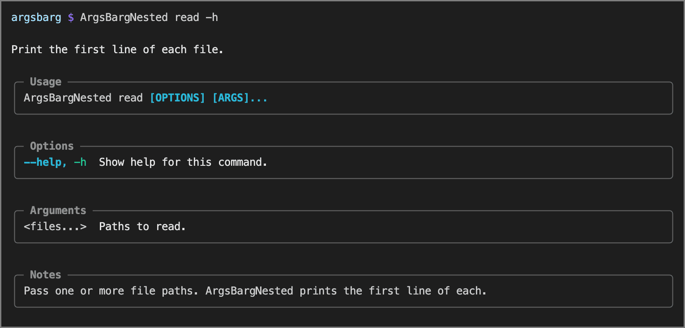

<!-- Big money NE - https://patorjk.com/software/taag/#p=testall&f=Bulbhead&t=shebangsy&x=none&v=4&h=4&w=80&we=false> -->

[](https://github.com/bdombro/bun-argsbarg)
[](LICENSE)
[](https://www.npmjs.com/package/argsbarg)
[](https://bun.sh)

Build beautiful, well-behaved CLI apps with Bun — **no third-party runtime dependencies**. 

Why another CLI parser?

*Schema-first* -- define your entire CLI’s structure, commands, options, and help in a single, explicit data model, making the command-line interface centralized, clear, and self-describing upfront.

*Bun-optimized* -- built from the ground up for Bun and TypeScript, leveraging Bun’s performance and modern JavaScript features without any extra dependencies.

Also checkout ArgsBarg for [cpp](https://github.com/bdombro/cpp-argsbarg), [nim](https://github.com/bdombro/nim-argsbarg), and [swift](https://github.com/bdombro/swift-argsbarg)!

Halps! -->


Sub-level Halps! -->


Shell completions! -->


## Usage

```typescript
import { cliRun, CliCommand, createOption, CliOptionKind, CliFallbackMode } from "argsbarg";

const cli: CliCommand = {
  key: "helloapp",
  description: "Tiny demo.",
  children: [
    {
      key: "hello",
      description: "Say hello.",
      options: [
        createOption("name", "Who to greet.", {
          kind: CliOptionKind.String,
          shortName: "n",
        }),
        createOption("verbose", "Enable extra logging.", {
          shortName: "v",
        }),
      ],
      handler: async (ctx) => {
        const name = ctx.stringOpt("name") ?? "world";
        if (ctx.flag("verbose")) { 
          console.log("verbose mode"); 
        }
        console.log(`hello ${name}`);
      },
    },
  ],
  fallbackCommand: "hello",
  fallbackMode: CliFallbackMode.MissingOrUnknown,
};

await cliRun(cli);
```

`cliRun` parses `process.argv`, prints help or errors, dispatches the leaf handler, and **exits the process**.


## What is it?

Everything you need for a first-class CLI:

- **Nested subcommands** (`CliCommand` with `children` for groups, `handler` for leaves)
- **POSIX-style options** (`-x`, `--long`, `--long=value`)
- **Bundled presence flags** (`-abc`)
- **Positional arguments and varargs tails** (`CliOptionDef` with `positional: true`)
- **Scoped help** at any routing depth (`-h` / `--help`)
- **Default-command fallback** (`CliFallbackMode`)
- **Option separator** (`--` to stop option parsing)
- **Rich help**: rounded UTF-8 boxes, tables, terminal width detection (`process.stdout.columns`), colors when stdout/stderr is a TTY
- **TypeScript-native**: Typed option accessors (`ctx.typedOpt<T>`) and `async/await` handler support.


## Built-ins

Every app gets:

- `-h` / `--help` at any routing depth (scoped help).
- **`completion bash` / `completion zsh`** — print shell completion scripts to stdout (injected by `cliRun`).

Do not declare a top-level command named **`completion`** — it is reserved for this built-in.


### Shell completions

```bash
myapp completion bash > ~/.bash_completion.d/myapp
# or: source <(myapp completion bash)

myapp completion zsh > ~/.zsh/completions/_myapp   
# then: fpath+=(~/.zsh/completions); autoload -Uz compinit && compinit
# or, for a one-off test in the current shell: eval "$(myapp completion zsh)"
```


## Install

```bash
bun add bun-argsbarg
```


## How it works

1. Build a **program root** `CliCommand` using pure TypeScript objects: `key` is the app/binary name, `children` are top-level subcommands, `options` are global flags. The root must not set `handler` or declare `positionals` (validated at startup). Use `fallbackCommand` / `fallbackMode` on the root only for default top-level routing.
2. Call `await cliRun(root)` with that root — validates, parses argv, renders help or errors, invokes the leaf handler, and `process.exit`s with status **0** on success, **1** on implicit help or error (explicit `--help` → **0**).
3. From a handler, `cliErrWithHelp(ctx, "message")` prints a red error line plus contextual help on stderr and exits **1**.

### Fallback modes (`CliFallbackMode`)

| Mode | Empty argv | Unknown first token |
| --- | --- | --- |
| `MissingOnly` | Default command | Error |
| `MissingOrUnknown` | Default command | Default command (token becomes argv for the default) |
| `UnknownOnly` | Root help (exit 1) | Default command |

With `MissingOrUnknown` / `UnknownOnly`, unrecognized **root** flags stop root-flag consumption and the remainder is passed to the default command.

### Positionals (help labels)

Use `createOption` with `positional: true`. With `argMax: 0`, the tail accepts at least `argMin` tokens and has no upper bound unless you set `argMax` > 0.

| Fields | Label |
| --- | --- |
| `positional: true`, default `argMin`/`argMax` | `<n>` |
| `positional: true`, `argMin: 0`, `argMax: 1` | `[n]` |
| `positional: true`, `argMin: 0`, `argMax: 0` | `[n...]` |
| `positional: true`, `argMin: 1`, `argMax: 0` | `<n...>` |

### Reading values (`CliContext`)

- `ctx.flag("verbose")` — presence options (`boolean`).
- `ctx.stringOpt("name")` / `ctx.numberOpt("count")` — `string | undefined` / `number | null`.
- `ctx.typedOpt<T>("custom", parseFn)` — pass a custom parsing function for type-safe option resolution.
- `ctx.args` — positional words in order as `string[]`.
- `ctx.schema` — merged program root (`CliCommand`) for contextual help.


## Examples

Check the `examples/` directory for full working scripts:

| Example | File | Shows |
| --- | --- | --- |
| `ArgsBargMinimal` | `examples/minimal.ts` | String + presence flags, `MissingOrUnknown` fallback. |
| `ArgsBargNested` | `examples/nested.ts` | Nested `CliCommand` tree, positional tails, async handlers. |

```bash
bun examples/minimal.ts --help
bun examples/minimal.ts hello --name world
bun examples/nested.ts stat owner lookup -u alice ./README.md
bun examples/nested.ts read ./README.md
```


## Public API overview

| Symbol | Role |
| --- | --- |
| `CliCommand`, `CliOptionDef`, `CliOptionKind`, `CliFallbackMode` | Schema types. |
| `createOption()` | Factory helper for options with sensible defaults. |
| `CliContext`, `CliHandler` | Handler context and async-compatible closure type. |
| `cliRun(root, [argv])` | Parse argv, dispatch, exit. |
| `cliErrWithHelp(ctx, msg)` | Error + scoped help, exit 1. |
| `cliHelpRender(schema, helpPath, useStderr)` | Render help (`schema` is the program root `CliCommand`). |

Reserved identifier (validated at startup): root command **`completion`**.

---

## License

MIT
