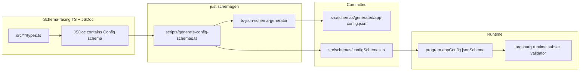

# Config schema (`program.appConfig`)

How to declare app configuration — flat JSON file, env overrides, handler access via `ctx.appConfig`, and a **recommended codegen pipeline** for typed config.

## Argsbarg contract

On the **program root**, set `appConfig` with metadata `entries` and optional block `jsonSchema`:

```typescript
import { Cli, type CliProgram } from "argsbarg";
import { APP_CONFIG_JSON_SCHEMA } from "./schemas/configSchemas.js";

const program = {
  key: "myapp",
  version: "1.0.0",
  description: "…",
  appConfig: {
    jsonSchema: APP_CONFIG_JSON_SCHEMA,
    entries: {
      apiToken: {
        description: "Create at https://example.com/settings/tokens",
        env: "API_TOKEN",
        sensitive: true,
      },
      defaultRegion: { description: "AWS region.", required: false },
      maxRetries: { description: "Retry count." },
    },
  },
  handler: (ctx) => {
    const token = ctx.appConfig.require("apiToken");
    const region = ctx.appConfig.get("defaultRegion"); // default already applied
  },
} satisfies CliProgram;

const cli = new Cli(program);
await cli.run();
```

| Where argsbarg uses it | Purpose |
| --- | --- |
| Config file | Flat JSON keyed by schema names; strict load (unknown keys rejected) |
| `install --configure` / `--status` | Interactive setup and status |
| Built-in `config get` / `config set` | Read/write resolved values (opt-out via `commands: false`) |
| MCP bundle / Claude plugin | `userConfig` for entries with `env` set |
| `ctx.appConfig` in handlers | `get`, `require`, `set`, `read`, `path` — prefer over `process.env` |

**Validation at runtime** — argsbarg validates the config file and `config set` / `ctx.appConfig.set` against the effective JSON Schema (block `jsonSchema` or synthesized all-string schema).

**No public config I/O exports** — consumers use `program.appConfig` for authoring and `ctx.appConfig` in handlers.

See [cli-program.md — Configuration](cli-program.md#configuration-programappconfig) for resolution order, bootstrap timing, and reserved `config` command.

## `CliAppConfig` and `CliAppConfigEntry`

```typescript
export interface CliAppConfigEntry {
  description: string;
  title?: string;       // default: config key
  default?: string;     // all-string mode only
  required?: boolean;   // default: true (can override jsonSchema required)
  sensitive?: boolean;  // default: name heuristic
  env?: string;         // env override + export to process.env after resolve
}

export interface CliAppConfig {
  path?: string;        // default: ~/.config/<key>/config (OS rules)
  commands?: boolean | { enabled?: boolean; mcpSet?: boolean };
  jsonSchema?: Record<string, unknown>;  // draft-07 block schema
  entries: Record<string, CliAppConfigEntry>;
}
```

**Conventions:**

- Secrets: `env: "API_TOKEN"` on entry; file key `apiToken`
- Prefs without env: local-file only; excluded from MCP/plugin manifests
- MCP manifests: only entries with `env` set (sanitized to snake_case keys)

## Config file shape

Flat JSON at `config.path` (default OS path unchanged):

```json
{
  "apiToken": "xxx",
  "defaultRegion": "eu-west-1",
  "maxRetries": 5,
  "prefs": { "ttl": 3600 }
}
```

No nested `env` bag. No extra keys — rejected on load.

## Resolution order (per schema key)

| Key has `env`? | Resolved value |
| --- | --- |
| **Yes** | non-empty `process.env[env]` → else file[key] → else default |
| **No** | file[key] → else default |

Empty string in env or file counts as **missing** for required entries. After resolution, mapped values are exported to `process.env`.

## Hand-written vs generated

| Approach | When |
| --- | --- |
| **Omit `jsonSchema`** | Simple apps; all values stored as strings; use `entry.default` |
| **Codegen from TypeScript** | Typed config, nested objects, shared with JSON Schema CI |

## Recommended pipeline (copy per repo)

Mirror the [output-schema.md](output-schema.md) pattern for config:



| Piece | Convention |
| --- | --- |
| Generator | [`ts-json-schema-generator`](https://github.com/vega/ts-json-schema-generator) |
| Discovery | JSDoc marker **`Config schema`** on the root config interface |
| Artifacts | Commit `app-config.json` and `configSchemas.ts` bridge exporting `APP_CONFIG_JSON_SCHEMA` |
| Consumer CI | Optional: `ajv` + `ajv-formats` against the same committed JSON (not an argsbarg runtime dep) |

### Supported AppConfig shapes (argsbarg runtime validator)

| Supported (v1) | Deferred |
| --- | --- |
| `type`, `properties`, `required`, `additionalProperties` | remote `$ref` |
| `enum`, `const`, `default` | complex `if`/`then`/`else` |
| local `#/definitions` + `$ref` | full draft-2020-12 |
| `anyOf` / `oneOf` (basic) | |
| `items`, `minItems`, `maxItems` | |
| `minimum`, `maximum`, `minLength`, `maxLength`, `pattern` | |

## Minimal example (no schemagen)

```typescript
appConfig: {
  entries: {
    apiToken: { description: "Token.", env: "API_TOKEN", sensitive: true },
    greeting: { description: "Greeting.", default: "hello", required: false },
  },
},
```

All file values are strings. Defaults come from `entry.default`.

## Built-in `config` command

When `program.appConfig` is set and `commands !== false`:

| Subcommand | Purpose |
| --- | --- |
| `config get [key]` | Resolved value(s); `--json`; `--json --pretty` |
| `config set <key> <value>` | One key; full document re-validated after merge |

`config get`/`set` skip required-config exit and TTY prompts. Sensitive values redact on `get` (`REDACTED` / `{ "set": true }` with `--json`).

Object/array/`$ref` properties require `--json` on `config set`.

## Example in this repo

| Example | Role |
| --- | --- |
| [`examples/config-app/`](../examples/config-app/) | **Learn** — hand-written schema, minimal setup |
| [`examples/consumer-app/`](../examples/consumer-app/) | **Copy** — schemagen discovery, `APP_CONFIG_JSON_SCHEMA` bridge |

```bash
cd examples/consumer-app && bun install && bun run schemagen
CONSUMER_APP_API_TOKEN=dev bun run start config get apiToken --json
```

Set `CONSUMER_APP_CONFIG_FILE` to override the config file path.
