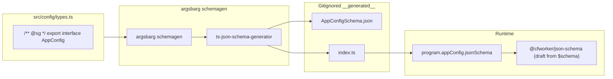

# Config schema (`program.appConfig`)

How to declare app configuration — flat JSON file, env overrides, handler access via `ctx.appConfig`, and a **recommended codegen pipeline** for typed config.

## Argsbarg contract

On the **program root**, set `appConfig` with metadata `entries` and optional block `jsonSchema`:

```typescript
import { Cli, type CliProgram } from "argsbarg";
import { APP_CONFIG_JSON_SCHEMA } from "./schemas/configSchemas.js";

const program = {
  key: "myapp",
  version: "1.0.0",
  description: "…",
  appConfig: {
    jsonSchema: APP_CONFIG_JSON_SCHEMA,
    entries: {
      apiToken: {
        description: "Create at https://example.com/settings/tokens",
        env: "API_TOKEN",
        sensitive: true,
      },
      defaultRegion: { description: "AWS region.", required: false },
      maxRetries: { description: "Retry count." },
    },
  },
  handler: (ctx) => {
    const token = ctx.appConfig.require("apiToken");
    const region = ctx.appConfig.get("defaultRegion"); // default already applied
  },
} satisfies CliProgram;

const cli = new Cli(program);
await cli.run();
```

| Where argsbarg uses it | Purpose |
| --- | --- |
| Config file | Flat JSON keyed by schema names; strict load (unknown keys rejected) |
| Interactive `configure` / `--status` | Auto-runs config wizard when `entries` is non-empty; `--status` for read-only inventory |
| Built-in `configure get` / `configure set` | Read/write resolved values (opt-out via `commands: false`) |
| MCP bundle / Claude plugin | `userConfig` for entries with `env` set |
| `ctx.appConfig` in handlers | `get`, `require`, `set`, `read`, `getUnsafe`, `setUnsafe`, `readUnsafe`, `path`, `dir` — prefer `get`/`set` when `appConfig` is set |

**Handler access** — with `program.appConfig`: `get` / `set` / `require` use schema validation and resolved values. `getUnsafe` / `setUnsafe` / `readUnsafe` read and write the raw file (for `_bindings` and ad-hoc keys). Without `program.appConfig`, only `path`, `dir`, and the `*Unsafe` methods work.

**`_bindings`** — reserved top-level metadata: `{ "_bindings": { "apiToken": "env" } }`. Set via wizard (Enter to use env), `configure set --from-env`, or `ctx.appConfig.set` (marks `file`). Optional keys can be bound to `skip`.

**Validation at runtime** — argsbarg validates the config file and `configure set` / `ctx.appConfig.set` against the effective JSON Schema ([validation](json-schema-subset.md)). Draft is chosen from `jsonSchema.$schema` (default Draft-07). Partial writes (bindings only, single-key updates) skip required-property checks.

See [cli-program.md — Configuration](cli-program.md#configuration-programappconfig) for resolution order, bootstrap timing, and `configure get`/`set`.

## `CliAppConfig` and `CliAppConfigEntry`

```typescript
export interface CliAppConfigEntry {
  description: string;
  title?: string;       // default: config key
  default?: string;     // all-string mode only
  required?: boolean;   // default: true (can override jsonSchema required)
  sensitive?: boolean;  // default: name heuristic
  env?: string;         // env override + export to process.env after resolve
  resolve?: CliAppConfigResolveFn;  // fallback after file; must be synchronous
}

export interface CliAppConfig {
  commands?: boolean | { enabled?: boolean; mcpSet?: boolean };
  jsonSchema?: Record<string, unknown>;  // JSON Schema block; include $schema to opt into 2019-09 / 2020-12
  entries: Record<string, CliAppConfigEntry>;
}
```

**Conventions:**

- Secrets: `env: "API_TOKEN"` on entry; file key `apiToken`
- Prefs without env: local-file only; excluded from MCP/plugin manifests
- MCP manifests: only entries with `env` set (sanitized to snake_case keys)

## Config file shape

Flat JSON at `~/.local/lib/<sanitized-key>/config`:

```json
{
  "apiToken": "xxx",
  "defaultRegion": "eu-west-1",
  "maxRetries": 5,
  "prefs": { "ttl": 3600 }
}
```

No nested `env` bag. No extra keys — rejected on load.

## Resolution order (per schema key)

| Step | Source | Notes |
| --- | --- | --- |
| 1 | **Env** (`entry.env`) | Non-empty host env wins over file and `resolve` |
| 2 | **File** | `config.json` value for the key |
| 3 | **`resolve()`** | Optional synchronous callback (e.g. `gh auth token`); return `undefined` to continue. Async/Promise return values are ignored. |
| 4 | **Env** (`entry.env`) | Fallback when `resolve` returned `undefined` |
| 5 | **Default** | `jsonSchema` / `entry.default` |

Empty string in env or file counts as **missing** for required entries. After resolution, mapped values are exported to `process.env`.

Example — GitHub token with `env: "GH_TOKEN"` and `resolve` calling `gh auth token`:

```typescript
githubToken: {
  description: "GitHub API token.",
  env: "GH_TOKEN",
  sensitive: true,
  resolve: () => {
    try {
      const r = Bun.spawnSync(["gh", "auth", "token"], { stdout: "pipe", stderr: "ignore" });
      if (r.exitCode === 0) {
        const token = new TextDecoder().decode(r.stdout).trim();
        return token.length > 0 ? token : undefined;
      }
    } catch {
      // `gh` not installed
    }
    return undefined;
  },
},
```

Interactive `configure` does not persist values supplied only by env or `resolve` when you press Enter to accept the current value.

## Hand-written vs generated

| Approach | When |
| --- | --- |
| **Omit `jsonSchema`** | Simple apps; all values stored as strings; use `entry.default` |
| **Codegen from TypeScript** | Typed config, nested objects, shared with JSON Schema CI |

## Recommended pipeline (argsbarg schemagen)

Mirror the [output-schema.md](output-schema.md) pattern for config:


```mermaid
flowchart LR
  subgraph src [src/config/types.ts]
    Marker["/** @sg */ export interface AppConfig"]
  end
  subgraph gen [argsbarg schemagen]
    Script["argsbarg schemagen"]
    Gen["ts-json-schema-generator"]
  end
  subgraph artifacts [Gitignored __generated__]
    Json["AppConfigSchema.json"]
    Index["index.ts"]
  end
  subgraph runtime [Runtime]
    Program["program.appConfig.jsonSchema"]
    Validate["@cfworker/json-schema (draft from $schema)"]
  end
  src --> Script --> Gen --> Json
  Gen --> Index --> Program --> Validate
```

| Piece | Convention |
| --- | --- |
| Generator | [`ts-json-schema-generator`](https://github.com/vega/ts-json-schema-generator) (bundled with argsbarg) |
| Discovery | `/** @sg */` on `AppConfig` in `src/config/types.ts` (or any scanned `src/**/*.ts`) |
| Artifacts | `src/config/__generated__/AppConfigSchema.json` — gitignored; run `just schemagen` after clone |
| Consumer CI | Optional: `ajv` + `ajv-formats` against the same committed JSON (not an argsbarg runtime dep) |

Example:

```typescript
// src/config/types.ts
/** @sg */
export interface AppConfig {
  apiToken: string;
}
```

Wire on the program root: `import { AppConfigSchema } from "./config/__generated__"`.

### Supported AppConfig shapes (runtime validation)

Validation is [@cfworker/json-schema](https://www.npmjs.com/package/@cfworker/json-schema) with draft from `$schema` (default Draft-07). See [json-schema-subset.md](json-schema-subset.md) for drafts, Zod interop, and limits.

| Commonly used | Notes |
| --- | --- |
| `type`, `properties`, `required`, `additionalProperties` | |
| `enum`, `const` | `default` is not applied at validation time |
| local `#/definitions` + `$ref` (Draft-07) or `#/$defs` + `$ref` (2020-12) | remote `$ref` not supported |
| `anyOf` / `oneOf` / `allOf` | |
| `items`, `minItems`, `maxItems` | |
| `minimum`, `maximum`, `minLength`, `maxLength`, `pattern` | |
| `format` | includes argsbarg `comma-list` |

## Minimal example (no schemagen)

```typescript
appConfig: {
  entries: {
    apiToken: { description: "Token.", env: "API_TOKEN", sensitive: true },
    greeting: { description: "Greeting.", default: "hello", required: false },
  },
},
```

All file values are strings. Defaults come from `entry.default`.

## Built-in `configure get` / `configure set`

When `program.appConfig` is set and `commands !== false`:

| Subcommand | Purpose |
| --- | --- |
| `configure get [key]` | Resolved value(s); `--json`; `--json --pretty` |
| `configure set <key> <value>` | One key; full document re-validated after merge |

`configure get`/`set` skip required-config exit and TTY prompts. Sensitive values redact on `get` (`REDACTED` / `{ "set": true }` with `--json`).

Object/array/`$ref` properties require `--json` on `configure set` when comma-separated or JSON-literal input does not apply (e.g. objects, arrays of objects). Homogeneous primitive arrays (`string[]`, `number[]`, `integer[]`, `boolean[]`, and `string[]` with `format: date` / `date-time` on items) accept comma-separated values or a JSON array in both `configure set` and interactive `configure`.

## Example in this repo

| Example | Role |
| --- | --- |
| [`examples/full-example-json/`](../examples/full-example-json/) | **Schema-first copy template** — `@sg` schemagen, builtins; optional `program.appConfig` |

```bash
cd examples/full-example-json && just setup && just schemagen
FULL_EXAMPLE_JSON_API_TOKEN=dev just run configure get apiToken --json
```
