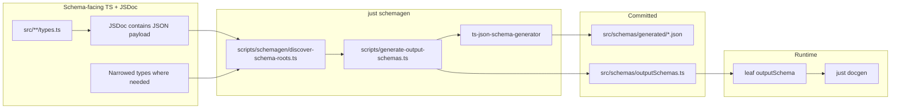

# Output schemas (`outputSchema`)

How to describe JSON stdout on leaf commands — and a **recommended codegen pipeline** used in production argsbarg apps.

## Argsbarg contract

On **leaf commands**, set `outputSchema` to a JSON Schema object when the handler emits JSON (typically with `--json`, always for JSON-only commands, or on the MCP headless path).

```typescript
import { STATUS_JSON_OUTPUT_SCHEMA } from "../schemas/outputSchemas.js";

export const status = {
  key: "status",
  description: "Show environment status.",
  outputSchema: STATUS_JSON_OUTPUT_SCHEMA,
  handler: async (ctx) => { /* writes JSON to stdout */ },
} satisfies CliLeaf;
```

| Where argsbarg uses it | Purpose |
| --- | --- |
| `myapp docs schema` | Full command tree JSON export |
| `myapp docs api` | Markdown per-command **Output** section |
| `myapp docs skill` | `reference.md` for agent skills |
| MCP `tools/list` | Optional `outputSchema` on each tool |

**Not validated at runtime** — argsbarg does not parse or reject handler stdout against the schema today. The schema is documentation and MCP metadata.

**Set on the leaf only** — not under `mcpTool` (legacy `mcpTool.outputSchema` still resolves but is deprecated).

**Draft version** — argsbarg accepts any JSON Schema object (`type`, `properties`, `definitions`, etc.). Generators may emit draft-07 or draft 2020-12; docgen embeds the object as-is.

See [cli-program.md — Structured stdout](cli-program.md#structured-stdout) for when to use `outputSchema` vs `notes`, and [mcp.md](mcp.md) for how MCP returns parsed JSON as `structuredContent`.

## Hand-written vs generated

| Approach | When |
| --- | --- |
| **Inline object** on the leaf | One-off commands, spikes, very small shapes |
| **Codegen from TypeScript** | Multiple commands share a shape, nested objects, or you want rich `description` fields in `docs api` / skills |

Production CLIs with several JSON commands tend to use **codegen** so types, handlers, and schemas stay aligned.

## Recommended pipeline (copy per repo)

No shared npm package — each app copies the same **contract**. Reference implementations: **sqsp-qa-tools**, **idp-trees**, **sqsp-i18n-tools** (see each repo’s `docs/architecture.md` for which commands use which schema root).



| Piece | Convention |
| --- | --- |
| Generator | [`ts-json-schema-generator`](https://github.com/vega/ts-json-schema-generator) (`createGenerator` with `jsDoc: "extended"`) |
| Config | `tsconfig: "tsconfig.json"`, `topRef: false`, `skipTypeCheck: false` |
| Discovery | Walk `src/**/types.ts`; treat `export interface` as a schema root when its JSDoc contains **`JSON payload`** |
| Artifacts | Commit `src/schemas/generated/*.json` **and** auto-generated `src/schemas/outputSchemas.ts` |
| tsconfig | `"resolveJsonModule": true` |
| CI | `just check`: `schemagen` → `git diff --exit-code src/schemas/generated/ src/schemas/outputSchemas.ts` → typecheck |
| Docgen | `docgen` depends on `schemagen` so saved `./docs/api.md` and `./docs/schema.json` are fresh |

Copy these scripts into each consumer repo (they are intentionally duplicated, not published):

- `scripts/generate-output-schemas.ts` — generate JSON + rewrite the bridge
- `scripts/schemagen/discover-schema-roots.ts` — find roots and map names → filenames / export constants
- `scripts/schemagen/discover-schema-roots.test.ts` — lock discovery and naming per app

### Marking a schema root

Put schema-facing interfaces in **`src/**/types.ts`** (e.g. `src/commands/status/types.ts`, `src/ui/runHeadless/types.ts`, `src/core/types.ts`). Add a JSDoc line containing **`JSON payload`** on the exported interface:

```typescript
/** JSON payload for `myapp status --json`. */
export interface StatusJsonOutput {
  items: StatusJsonItem[];
}

/** JSON payload written to stdout after a headless mutating command. */
export interface HeadlessOpResult {
  command: string;
  exitCode: number;
  tasks: HeadlessTaskResult[];
}
```

`discoverSchemaRoots` scans only files named `types.ts` under `src/`. Nested helper interfaces in the same file are included in the generated schema when referenced by a root; they are **not** separate JSON files unless they are also marked roots.

### Stable naming (outfile + bridge export)

Discovery maps each root type name to a generated filename and `outputSchemas.ts` constant. Suffix conventions (implemented in `outfileForType` / `schemaExportName`):

| Type suffix | Example type | Generated file | Bridge export |
| --- | --- | --- | --- |
| `JsonOutput` | `StatusJsonOutput` | `status.json` | `STATUS_JSON_OUTPUT_SCHEMA` |
| `OpResult` | `HeadlessOpResult` | `headless-op-result.json` | `HEADLESS_OP_RESULT_OUTPUT_SCHEMA` |
| `Output` | `OpenUrlOutput` | `open-url.json` | `OPEN_URL_OUTPUT_SCHEMA` |
| `Result` | `UidsResult` | `uids.json` | `UIDS_OUTPUT_SCHEMA` |

Prefer these suffixes for new roots so filenames and import constants stay predictable across repos.

### Generated bridge

`scripts/generate-output-schemas.ts` rewrites `src/schemas/outputSchemas.ts` on every run:

```typescript
// Auto-generated by scripts/generate-output-schemas.ts — do not edit by hand.

import status from "./generated/status.json";

/** JSON Schema for `myapp status --json`. */
export const STATUS_JSON_OUTPUT_SCHEMA = status as Record<string, unknown>;
```

Wire the constant on each leaf that emits that shape (several commands may share one schema, e.g. mutating ops sharing `HeadlessOpResult`).

## Schema-facing types

**Goal:** generated schemas match what handlers actually print, with descriptions agents can read in `docs api`.

1. **Schema roots** — `export interface` in a `types.ts` file, with **`JSON payload`** in the interface JSDoc naming which command(s) emit it.
2. **Per property** — `/** … */` on every field that should appear in JSON Schema `properties` (including nested named types).
3. **Unions / enums** — document the alias; generator emits `enum` / `anyOf` with type-level description.
4. **Formats** — property JSDoc can include `@format date-time` for ISO timestamps; add a smoke test that the generated property has `format: "date-time"`.
5. **Do not hand-edit** `src/schemas/generated/` or `src/schemas/outputSchemas.ts` — change types/JSDoc, run `just schemagen`, commit both.

### Narrowing when runtime ≠ stdout

When a shared runtime type is **wider** than one command’s JSON, add a **schema-facing** root in `types.ts` (still marked `JSON payload`):

```typescript
/** Runtime union across commands. */
export type ResultSource = TranslationReadinessSource | { kind: "uids"; uids: string[] };

/** JSON payload for `myapp pr` and `myapp file`. */
export interface TranslationReadinessResult {
  source: TranslationReadinessSource;
  evaluatedAt: string;
  // ...
}
```

Patterns:

- **Shallow dashboard types** — separate interfaces from fat API types so generated schema stays readable.
- **Assignability tests** — ensure runtime rows satisfy schema-facing types so refactors cannot drift.

Handlers keep using runtime types; only discovered roots (and their type graph) feed codegen.

## Tests

Per repo:

- **`scripts/schemagen/discover-schema-roots.test.ts`** — asserts which roots are discovered and stable outfile / export-name mapping.
- **`src/schemas/outputSchemas.test.ts`** (optional) — schema shape smoke tests: object root, key `description` fields, enums, `@format date-time`.

## Contributor workflow

1. Add or edit schema-facing interfaces in `src/**/types.ts` with **`JSON payload`** JSDoc and per-field descriptions.
2. `just schemagen` — refresh `src/schemas/generated/` and `src/schemas/outputSchemas.ts`.
3. Import the bridge constant on the relevant leaf `outputSchema` fields.
4. Commit generated JSON and the bridge with the type changes.
5. `just docgen` / `myapp docs api --save` — refresh consumer docs.
6. Document which commands use which roots in **your** `docs/architecture.md` (argsbarg does not maintain per-app tables).

Add a bullet under your app’s `**… conventions:**` block in `.cursor/rules/cli-program.mdc` pointing at `node_modules/argsbarg/docs/output-schema.md` and your `src/schemas/` layout.

**Reference implementation:** [`examples/consumer-app/`](../examples/consumer-app/) in this repo (shipped in npm as `node_modules/argsbarg/examples/consumer-app/`) — discovery script, bridges, and `status` leaf with `outputSchema`.

## Out of scope

- Shared codegen package or monorepo tooling
- Runtime Zod / `.parse()` on stdout in argsbarg
- `outputSchema` for plain-text, streaming, or Ink-only commands
- Schema roots outside `src/**/types.ts` (use a dedicated `types.ts` next to handlers instead of `resolve.ts`)

## See also

- [cli-program.md](cli-program.md) — structured stdout, headless JSON, `read*Flags`
- [mcp.md](mcp.md) — `tools/list`, `structuredContent`
- [bundled-docs.md](bundled-docs.md) — `docs api` / `docs schema` docgen
- [docs/README.md](README.md) — documentation map
