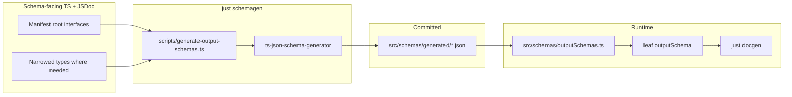

# Output schemas (`outputSchema`)

How to describe JSON stdout on leaf commands — and a **recommended codegen pipeline** used in production argsbarg apps.

## Argsbarg contract

On **leaf commands**, set `outputSchema` to a JSON Schema object when the handler emits JSON (typically with `--json`, always for JSON-only commands, or on the MCP headless path).

```typescript
import { STATUS_OUTPUT_SCHEMA } from "../schemas/outputSchemas.js";

export const status = {
  key: "status",
  description: "Show environment status.",
  outputSchema: STATUS_OUTPUT_SCHEMA,
  handler: async (ctx) => { /* writes JSON to stdout */ },
} satisfies CliLeaf;
```

| Where argsbarg uses it | Purpose |
| --- | --- |
| `myapp docs schema` | Full command tree JSON export |
| `myapp docs api` | Markdown per-command **Output** section |
| `myapp docs skill` | `reference.md` for agent skills |
| MCP `tools/list` | Optional `outputSchema` on each tool |

**Not validated at runtime** — argsbarg does not parse or reject handler stdout against the schema today. The schema is documentation and MCP metadata.

**Set on the leaf only** — not under `mcpTool` (legacy `mcpTool.outputSchema` still resolves but is deprecated).

**Draft version** — argsbarg accepts any JSON Schema object (`type`, `properties`, `definitions`, etc.). Generators may emit draft-07 or draft 2020-12; docgen embeds the object as-is.

See [cli-program.md — Structured stdout](cli-program.md#structured-stdout) for when to use `outputSchema` vs `notes`, and [mcp.md](mcp.md) for how MCP returns parsed JSON as `structuredContent`.

## Hand-written vs generated

| Approach | When |
| --- | --- |
| **Inline object** on the leaf | One-off commands, spikes, very small shapes |
| **Codegen from TypeScript** | Multiple commands share a shape, nested objects, or you want rich `description` fields in `docs api` / skills |

Production CLIs with several JSON commands tend to use **codegen** so types, handlers, and schemas stay aligned.

## Recommended pipeline (copy per repo)

No shared npm package — each app copies the same **contract**. Reference implementations: **sqsp-qa-tools**, **idp-trees**, **sqsp-i18n-tools** (see each repo’s `docs/architecture.md` for manifest tables).



| Piece | Convention |
| --- | --- |
| Generator | [`ts-json-schema-generator`](https://github.com/vega/ts-json-schema-generator) (e.g. `createGenerator` with `jsDoc: "extended"`) |
| Config | `tsconfig: "tsconfig.json"`, `topRef: false`, `skipTypeCheck: false` |
| Manifest | Explicit `{ typeName, path, outfile }[]` — only **roots** become schema files |
| Artifacts | Commit `src/schemas/generated/*.json` |
| Bridge | `src/schemas/outputSchemas.ts` imports JSON → `*_OUTPUT_SCHEMA` constants |
| tsconfig | `"resolveJsonModule": true` |
| CI | `just check`: run `schemagen` → `git diff --exit-code src/schemas/generated/` → typecheck |
| Docgen | `docgen` depends on `schemagen` so saved `./docs/api.md` and `./docs/schema.json` are fresh |

Type files can live anywhere the manifest points (`commands/<cmd>/types.ts`, `resolve.ts`, `core/types.ts`, `ui/runHeadless.ts`).

### Example manifest + generator

```typescript
const MANIFEST = [
  { typeName: "StatusJsonOutput", path: "src/commands/status/resolve.ts", outfile: "status.json" },
  { typeName: "HeadlessOpResult", path: "src/ui/runHeadless.ts", outfile: "headless-op-result.json" },
];

for (const entry of MANIFEST) {
  const generator = createGenerator({
    path: path.join(ROOT, entry.path),
    type: entry.typeName,
    tsconfig: path.join(ROOT, "tsconfig.json"),
    topRef: false,
    skipTypeCheck: false,
    jsDoc: "extended",
  });
  fs.writeFileSync(
    path.join(OUT_DIR, entry.outfile),
    `${JSON.stringify(generator.createSchema(entry.typeName), null, 2)}\n`,
  );
}
```

### Example bridge

```typescript
import statusJson from "./generated/status.json";

export const STATUS_JSON_OUTPUT_SCHEMA = statusJson as Record<string, unknown>;
```

Wire the constant on each leaf that emits that shape (several commands may share one schema, e.g. mutating ops sharing `HeadlessOpResult`).

## Schema-facing types

**Goal:** generated schemas match what handlers actually print, with descriptions agents can read in `docs api`.

1. **Manifest roots** — `export interface` (preferred) or documented type alias; top-level JSDoc names which command(s) emit it.
2. **Per property** — `/** … */` on every field that should appear in JSON Schema `properties` (including nested named types).
3. **Unions / enums** — document the alias; generator emits `enum` / `anyOf` with type-level description.
4. **Formats** — property JSDoc can include `@format date-time` for ISO timestamps; add a smoke test that the generated property has `format: "date-time"`.
5. **Do not hand-edit** `src/schemas/generated/` — change types/JSDoc, run `just schemagen`, commit JSON.

### Narrowing when runtime ≠ stdout

When a shared runtime type is **wider** than one command’s JSON, add a **schema-facing** type:

```typescript
/** Runtime union across commands. */
export type ResultSource = TranslationReadinessSource | { kind: "uids"; uids: string[] };

/** JSON for `pr` and `file` only — no `uids` variant. */
export interface TranslationReadinessResult {
  source: TranslationReadinessSource;
  evaluatedAt: string;
  // ...
}
```

Patterns:

- **Shallow dashboard types** — separate interfaces from fat API types so generated schema stays readable.
- **Assignability tests** — `expectTypeOf<RuntimeRow>().toMatchTypeOf<SchemaFacingRow>()` or equivalent so refactors cannot drift.

Handlers keep using runtime types; only the manifest root (and its graph) feed codegen.

## Tests

After wiring, add `src/schemas/outputSchemas.test.ts` (or similar):

- Each exported schema has `type: "object"` (or expected root).
- Key `properties` / `definitions` have non-empty `description` from JSDoc.
- Spot-check enums, required fields, and `@format date-time` where it matters.

## Contributor workflow

1. Edit schema-facing interfaces and JSDoc.
2. `just schemagen` — refresh `src/schemas/generated/`.
3. Commit generated JSON with the type changes.
4. `just docgen` / `myapp docs api --save` — refresh consumer docs.
5. Document app-specific manifest roots in **your** `docs/architecture.md` (not in argsbarg).

Add a bullet under your app’s `**… conventions:**` block in `.cursor/rules/cli-program.mdc` pointing at `node_modules/argsbarg/docs/output-schema.md` and your `src/schemas/` layout.

## Out of scope

- Shared codegen package or monorepo tooling
- Runtime Zod / `.parse()` on stdout in argsbarg
- `outputSchema` for plain-text, streaming, or Ink-only commands
- Forcing identical file layout across repos — the **manifest** is authoritative

## See also

- [cli-program.md](cli-program.md) — structured stdout, headless JSON, `read*Flags`
- [mcp.md](mcp.md) — `tools/list`, `structuredContent`
- [bundled-docs.md](bundled-docs.md) — `docs api` / `docs schema` docgen
- [docs/README.md](README.md) — documentation map
