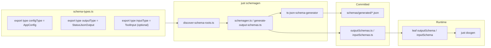

# Output schemas (`outputSchema`)

How to describe JSON stdout on leaf commands — and a **recommended codegen pipeline** used in production argsbarg apps.

## Argsbarg contract

On **leaf commands**, set `outputSchema` to a JSON Schema object when the handler emits JSON (typically with `--json`, always for JSON-only commands, or on the MCP headless path).

```typescript
import { STATUS_JSON_OUTPUT_SCHEMA } from "../schemas/outputSchemas.js";

export const status = {
  key: "status",
  description: "Show environment status.",
  outputSchema: STATUS_JSON_OUTPUT_SCHEMA,
  handler: async (ctx) => { /* writes JSON to stdout */ },
} satisfies CliLeaf;
```

| Where argsbarg uses it | Purpose |
| --- | --- |
| `myapp docs cli-schema` | Full command tree JSON export |
| `myapp docs api` | Markdown per-command **Output** section |
| `myapp docs skill` | `reference.md` for agent skills |
| MCP `tools/list` | Optional `outputSchema` on each tool |
| HTTP `GET /openapi.json` | Response schema per tool |

**Not validated at runtime** — argsbarg does not parse or reject handler stdout against the schema today. The schema is documentation and MCP/HTTP metadata.

**Set on the leaf only** — not under `mcpTool` (legacy `mcpTool.outputSchema` still resolves but is deprecated).

**Draft version** — argsbarg accepts any JSON Schema object (`type`, `properties`, `definitions`, etc.). Generators may emit draft-07 or draft 2020-12; docgen embeds the object as-is.

See [cli-program.md — Structured stdout](cli-program.md#structured-stdout) for when to use `outputSchema` vs `notes`, and [mcp.md](mcp.md) for how MCP returns parsed JSON as `structuredContent`.

## Hand-written vs generated

| Approach | When |
| --- | --- |
| **Inline object** on the leaf | One-off commands, spikes, very small shapes |
| **Codegen from TypeScript** | Multiple commands share a shape, nested objects, or you want rich `description` fields in `docs api` / skills |

Production CLIs with several JSON commands tend to use **codegen** so types, handlers, and schemas stay aligned.

## Recommended pipeline (copy per repo)

No shared npm package — each app copies the same **contract**. Reference implementations: **sqsp-qa-manager-poc**, **sqsp-workspaces**, **sqsp-i18n-tools-poc**, **pdf-gen** (see each repo’s `docs/architecture.md` for which commands use which schema root).


```mermaid
flowchart LR
  subgraph types [schema-types.ts]
    Config["export type configType = AppConfig"]
    Output["export type outputType = StatusJsonOutput"]
    Input["export type inputType = ToolInput (optional)"]
  end
  subgraph gen [just schemagen]
    Discover["discover-schema-roots.ts"]
    Script["schemagen.ts / generate-output-schemas.ts"]
    Gen["ts-json-schema-generator"]
  end
  subgraph artifacts [Committed]
    Json["schemas/generated/*.json"]
    Bridge["outputSchemas.ts / inputSchemas.ts"]
  end
  subgraph runtime [Runtime]
    Leaves["leaf outputSchema / inputSchema"]
    Docgen["just docgen"]
  end
  types --> Discover --> Script --> Gen --> Json
  Script --> Bridge --> Leaves --> Docgen
```

| Piece | Convention |
| --- | --- |
| Generator | [`ts-json-schema-generator`](https://github.com/vega/ts-json-schema-generator) (`createGenerator` with `jsDoc: "extended"`) |
| Config | `tsconfig: "tsconfig.json"`, `topRef: false`, `skipTypeCheck: false` |
| Discovery | Walk `src/**/schema-types.ts`; generate from `export type outputType = …` / `inputType` / `configType` when the target type is **defined in that file** |
| Artifacts | Commit `schemas/generated/*.json` **and** auto-generated bridge modules |
| tsconfig | `"resolveJsonModule": true` |
| CI | `just check`: `schemagen` → `git diff --exit-code schemas/` → typecheck |
| Docgen | `docgen` depends on `schemagen` so saved `./docs/api.md` and `./docs/cli-schema.json` are fresh |

Copy these scripts into each consumer repo (they are intentionally duplicated, not published):

- `scripts/schemagen.ts` or `scripts/generate-output-schemas.ts` — generate JSON + rewrite bridges
- `scripts/schemagen/discover-schema-roots.ts` — find roots and map names → filenames / export constants
- `scripts/schemagen/discover-schema-roots.test.ts` — lock discovery and naming per app

### Declaring a schema root

Put schema-facing interfaces in **`schema-types.ts`** next to the command (or in a shared module when several commands reuse one shape). Export a role alias:

```typescript
// src/commands/status/schema-types.ts
import type { WorkspaceStatus } from "./types.ts";

/** JSON stdout for `myapp status --json`. */
export interface StatusJsonOutput {
  workspaces: WorkspaceStatus[];
}

/** Schemagen root for leaf outputSchema. */
export type outputType = StatusJsonOutput;
```

```typescript
// src/ui/runHeadless/schema-types.ts — shared by many mutating commands
import type { HeadlessTaskResult } from "./types.ts";

export interface HeadlessOpResult {
  command: string;
  exitCode: number;
  tasks: HeadlessTaskResult[];
}

export type outputType = HeadlessOpResult;
```

```typescript
// src/commands/render-invoice/schema-types.ts — custom HTTP/MCP body (pdf-gen)
export interface RenderInvoiceToolInput {
  format: "pdf" | "html";
  invoice: InvoiceData;
}

export type inputType = RenderInvoiceToolInput;
export type outputType = RenderInvoiceWrittenOutput;
```

| Export | Role |
| --- | --- |
| `export type configType = AppConfig` | `program.appConfig.jsonSchema` (one per repo, typically `src/config/schema-types.ts`) |
| `export type outputType = …` | `leaf.outputSchema` |
| `export type inputType = …` | `leaf.inputSchema` (only when the tool body is not flat CLI flags) |

**Domain helpers** stay in `types.ts` (or `core/types.ts`). Discovery scans only `schema-types.ts`. Re-export-only files (`export type outputType = HeadlessOpResult` pointing at another module) are **not** generation roots — generate once from the canonical definition file.

Commands without structured JSON omit `schema-types.ts` and import a shared bridge constant (e.g. `HEADLESS_OP_RESULT_OUTPUT_SCHEMA`).

When you do **not** set `inputSchema`, argsbarg builds tool input from CLI `options` + `positionals`.

### Stable naming (outfile + bridge export)

Discovery maps each root type name to a generated filename and bridge constant. Suffix conventions (implemented in `outfileForOutputType` / `outputSchemaExportName`):

| Type suffix | Example type | Generated file | Bridge export |
| --- | --- | --- | --- |
| `JsonOutput` | `StatusJsonOutput` | `status.json` | `STATUS_JSON_OUTPUT_SCHEMA` |
| `OpResult` | `HeadlessOpResult` | `headless-op-result.json` | `HEADLESS_OP_RESULT_OUTPUT_SCHEMA` |
| `Output` | `OpenUrlOutput` | `open-url.json` | `OPEN_URL_OUTPUT_SCHEMA` |
| `Result` | `PrResult` | `pr.json` | `PR_RESULT_OUTPUT_SCHEMA` |
| `ToolInput` | `RenderInvoiceToolInput` | `render-invoice-tool-input.json` | `RENDER_INVOICE_TOOL_INPUT_SCHEMA` |

Prefer these suffixes for new roots so filenames and import constants stay predictable across repos.

### Generated bridge

`scripts/schemagen.ts` rewrites `schemas/outputSchemas.ts` on every run:

```typescript
// Auto-generated by scripts/schemagen.ts — do not edit by hand.

import status from "./generated/status.json";

/** JSON Schema for leaf outputSchema from `StatusJsonOutput`. */
export const STATUS_JSON_OUTPUT_SCHEMA = status as Record<string, unknown>;
```

Wire the constant on each leaf that emits that shape (several commands may share one schema, e.g. mutating ops sharing `HeadlessOpResult`).

## Schema-facing types

**Goal:** generated schemas match what handlers actually print, with descriptions agents can read in `docs api`.

1. **Schema roots** — `export interface` in `schema-types.ts`, with `export type outputType = …` (or `inputType` / `configType`).
2. **Per property** — `/** … */` on every field that should appear in JSON Schema `properties` (including nested named types).
3. **Unions / enums** — document the alias; generator emits `enum` / `anyOf` with type-level description.
4. **Formats** — property JSDoc can include `@format date-time` for ISO timestamps; add a smoke test that the generated property has `format: "date-time"`.
5. **Do not hand-edit** `schemas/generated/` or bridge modules — change types/JSDoc, run `just schemagen`, commit both.

### Narrowing when runtime ≠ stdout

When a shared runtime type is **wider** than one command’s JSON, add a **schema-facing** root in `schema-types.ts`:

```typescript
/** JSON stdout for `myapp pr` and `myapp file`. */
export interface TranslationReadinessResult {
  source: TranslationReadinessSource;
  evaluatedAt: string;
}

export type outputType = TranslationReadinessResult;
```

Patterns:

- **Shallow dashboard types** — separate interfaces from fat API types so generated schema stays readable.
- **Assignability tests** — ensure runtime rows satisfy schema-facing types so refactors cannot drift.

Handlers keep using runtime types; only discovered roots (and their type graph) feed codegen.

## Tests

Per repo:

- **`scripts/schemagen/discover-schema-roots.test.ts`** — asserts which roots are discovered and stable outfile / export-name mapping.
- **`schemas/outputSchemas.test.ts`** (optional) — schema shape smoke tests: object root, key `description` fields, enums, `@format date-time`.

## Contributor workflow

1. Add or edit schema roots in `src/**/schema-types.ts` with `outputType` / `inputType` / `configType` and per-field JSDoc.
2. `just schemagen` — refresh `schemas/generated/` and bridge modules.
3. Import the bridge constant on the relevant leaf `outputSchema` / `inputSchema` fields.
4. Commit generated JSON and bridges with the type changes.
5. `just docgen` / `myapp docs api --save` — refresh consumer docs.
6. Document which commands use which roots in **your** `docs/architecture.md` (argsbarg does not maintain per-app tables).

Add a bullet under your app’s `**… conventions:**` block in `.cursor/rules/cli-program.mdc` pointing at `node_modules/argsbarg/docs/output-schema.md` and your `schemas/` layout.

**Reference implementation:** [`examples/full-example/`](../examples/full-example/) in this repo (shipped in npm as `node_modules/argsbarg/examples/full-example/`) — discovery script, bridges, and `status` leaf with `outputSchema`.

## Out of scope

- Shared codegen package or monorepo tooling
- Runtime Zod / `.parse()` on stdout in argsbarg
- `outputSchema` for plain-text, streaming, or Ink-only commands

## See also

- [config-schema.md](config-schema.md) — `configType` / `program.appConfig`
- [cli-program.md](cli-program.md) — structured stdout, headless JSON, `read*Flags`
- [mcp.md](mcp.md) — `tools/list`, `structuredContent`
- [bundled-docs.md](bundled-docs.md) — `docs api` / `docs cli-schema` docgen
- [docs/README.md](README.md) — documentation map
