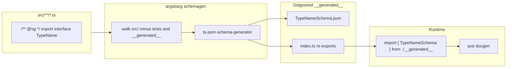

# Output schemas (`outputSchema`)

How to describe JSON stdout on leaf commands — and the **argsbarg schemagen** pipeline used in production apps.

## Argsbarg contract

On **leaf commands**, set `outputSchema` to a JSON Schema object when the handler emits JSON (typically with `--json`, always for JSON-only commands, or on the MCP headless path).

```typescript
import { StatusJsonOutputSchema } from "./__generated__";

export const status = {
  key: "status",
  description: "Show environment status.",
  outputSchema: StatusJsonOutputSchema,
  handler: async (ctx) => { /* writes JSON to stdout */ },
} satisfies CliLeaf;
```

| Where argsbarg uses it | Purpose |
| --- | --- |
| `myapp docs cli-schema` | Full command tree JSON export |
| `myapp docs cli` | Markdown per-command **Output** section |
| `myapp docs skill` | `reference.md` for agent skills |
| MCP `tools/list` | Optional `outputSchema` on each tool |
| HTTP `GET /openapi.json` | Response schema per tool |

**Not validated at runtime** — argsbarg does not parse or reject handler stdout against the schema today. The schema is documentation and MCP/HTTP metadata.

**Set on the leaf only** — not under `mcpTool`.

**Draft version** — for **`inputSchema`** and **`appConfig.jsonSchema`**, argsbarg validates using the draft declared in `$schema` (default Draft-07 when omitted). Schemas from schemagen, `zod-to-json-schema`, or `z.toJSONSchema()` may use Draft-07 or 2020-12. **`outputSchema`** is embedded in docs/MCP/OpenAPI as-is and is not runtime-validated.

See [cli-program.md — Structured stdout](cli-program.md#structured-stdout) for when to use `outputSchema` vs `notes`, and [mcp.md](mcp.md) for how MCP returns parsed JSON as `structuredContent`.

## Hand-written vs generated

| Approach | When |
| --- | --- |
| **Inline object** on the leaf | One-off commands, spikes, very small shapes |
| **Codegen from TypeScript** | Multiple commands share a shape, nested objects, or you want rich `description` fields in `docs cli` / skills |

Production CLIs with several JSON commands tend to use **codegen** so types, handlers, and schemas stay aligned.

## Schemagen pipeline (built into argsbarg)

No per-repo scripts to copy — run **`argsbarg schemagen`** (or `import { runSchemagen } from "argsbarg/schemagen"`).

Reference implementations: **sqsp-qa-manager-poc**, **sqsp-workspaces**, **sqsp-i18n-tools-poc**, **pdf-gen** (see each repo’s `docs/architecture.md` for which commands use which schema root).


```mermaid
flowchart LR
  subgraph src [src/**/*.ts]
    Sg["/** @sg */ export interface TypeName"]
  end
  subgraph gen [argsbarg schemagen]
    Walk["walk src/ minus tests and __generated__"]
    Gen["ts-json-schema-generator"]
  end
  subgraph artifacts [Gitignored __generated__]
    Json["TypeNameSchema.json"]
    Index["index.ts re-exports"]
  end
  subgraph runtime [Runtime]
    Leaves["import { TypeNameSchema } from ./__generated__"]
    Docgen["just docgen"]
  end
  src --> Walk --> Gen --> Json
  Gen --> Index --> Leaves --> Docgen
```

| Piece | Convention |
| --- | --- |
| Generator | [`ts-json-schema-generator`](https://github.com/vega/ts-json-schema-generator) (bundled as an argsbarg dependency) |
| Discovery | Walk `src/**/*.ts` (exclude `*.test.ts`, `__generated__/`); find `/** @sg */` JSDoc immediately followed by `export interface` or `export type` |
| Artifacts | One `__generated__/` per source directory; `{TypeName}Schema.json` + `export const {TypeName}Schema` in `index.ts` |
| Invocation | `just schemagen` — justfile exports `node_modules/.bin` on `PATH` for local `argsbarg` |
| tsconfig | `"resolveJsonModule": true` |
| CI | `just check`: `schemagen` → typecheck (no git diff on generated files) |
| Cleanup | Schemagen removes orphan `__generated__/` dirs and stale JSON when roots are removed |
| Docgen | `docgen` depends on `schemagen` so saved `./docs/cli.md` and `./docs/cli-schema.json` are fresh |

### Declaring a schema root

Mark any exported interface or type with `/** @sg */` on the line immediately above the declaration (no blank line):

```typescript
// src/commands/status/types.ts
/** @sg */
export interface StatusJsonOutput {
  version: string;
}
```

Handlers import types from the same module; leaves import schemas from `./__generated__`:

```typescript
import { StatusJsonOutputSchema } from "./__generated__";
```

Shared shapes in one directory share one `__generated__/index.ts`:

```typescript
// src/ui/runHeadless/types.ts
/** @sg */
export interface HeadlessOpResult {
  command: string;
  exitCode: number;
  tasks: HeadlessTaskResult[];
}
```

```typescript
// src/commands/render-invoice/types.ts
/** @sg */
export interface RenderInvoiceInput {
  format: "pdf" | "html";
  invoice: InvoiceData;
}

/** @sg */
export interface RenderInvoiceOutput {
  bytes: number;
}
```

Wire on the leaf or `program.appConfig`:

| Generated export | Typical use |
| --- | --- |
| `AppConfigSchema` | `program.appConfig.jsonSchema` (optional — `src/config/types.ts`) |
| `StatusJsonOutputSchema` | `leaf.outputSchema` |
| `RenderInvoiceInputSchema` | `leaf.inputSchema` |

For nested MCP/HTTP bodies, add a `kind: Json` option (same name as the schema property) and use `ctx.jsonOpt(...)`, `ctx.inputs`, or `ctx.inputsAs<T>()` — see [cli-program.md](cli-program.md#json-options-and-piped-stdin).

When you do **not** set `inputSchema`, argsbarg builds tool input from CLI `options` + `positionals`.

### Generated artifacts

Schemagen writes under `__generated__/` beside the `@sg` source files in each directory:

| Type name | Generated file | Exported const |
| --- | --- | --- |
| `StatusJsonOutput` | `StatusJsonOutputSchema.json` | `StatusJsonOutputSchema` |
| `RenderInvoiceInput` | `RenderInvoiceInputSchema.json` | `RenderInvoiceInputSchema` |

Wire on the leaf:

```typescript
import { StatusJsonOutputSchema } from "./__generated__";

export const statusCommand = {
  outputSchema: StatusJsonOutputSchema,
  // …
} satisfies CliLeaf;
```

App config (when used):

```typescript
import { AppConfigSchema } from "./config/__generated__";

appConfig: { jsonSchema: AppConfigSchema, entries: { … } },
```

## Schema-facing types

**Goal:** generated schemas match what handlers actually print, with descriptions agents can read in `docs cli`.

1. **Schema roots** — `/** @sg */` immediately above `export interface` or `export type`, with per-field JSDoc.
2. **Per property** — `/** … */` on every field that should appear in JSON Schema `properties` (including nested named types).
3. **Unions / enums** — document the alias; generator emits `enum` / `anyOf` with type-level description.
4. **Formats** — property JSDoc can include `@format date-time` for ISO timestamps; add a smoke test that the generated property has `format: "date-time"`.
5. **Do not hand-edit** `__generated__/` — change types/JSDoc in source files, run `just schemagen`.

### Narrowing when runtime ≠ stdout

When a shared runtime type is **wider** than one command’s JSON, add a **schema-facing** root in `types.ts`:

```typescript
/** JSON stdout for `myapp pr` and `myapp file`. */
export interface TranslationReadinessResult {
  source: TranslationReadinessSource;
  evaluatedAt: string;
}

/** @sg */
export interface TranslationReadinessResult {
```

Patterns:

- **Shallow dashboard types** — separate interfaces from fat API types so generated schema stays readable.
- **Assignability tests** — ensure runtime rows satisfy schema-facing types so refactors cannot drift.

Handlers keep using runtime types; only discovered roots (and their type graph) feed codegen.

## Tests

In argsbarg: `src/cli-tool/schemagen/schemagen.test.ts` locks discovery and generation against `examples/full-example-json/`.

Per consumer repo (optional):

- **`src/generated-schemas.test.ts`** — smoke-test that key `outputSchema` objects have expected shape.

## Contributor workflow

1. Add or edit `/** @sg */` roots in `src/**/*.ts` with per-field JSDoc.
2. `just schemagen` — refresh `src/**/__generated__/`.
3. Import `{ TypeNameSchema }` from the relevant `./__generated__` barrel.
4. `just docgen` / `myapp docs cli --save` — refresh consumer docs.
5. Document which commands use which roots in **your** `docs/architecture.md` (argsbarg does not maintain per-app tables).

Add a bullet under your app’s `**… conventions:**` block in `.cursor/rules/cli-program.mdc` pointing at `node_modules/argsbarg/docs/output-schema.md`.

**Reference implementation:** [`examples/full-example-json/`](../examples/full-example-json/) in this repo — `@sg` on command types, `__generated__/`, and `status` leaf with `StatusJsonOutputSchema`.

## Out of scope

- Runtime Zod / `.parse()` on stdout in argsbarg
- `outputSchema` for plain-text, streaming, or Ink-only commands

## See also

- [config-schema.md](config-schema.md) — `configType` / `program.appConfig`
- [cli-program.md](cli-program.md) — structured stdout, headless JSON, `read*Flags`
- [mcp.md](mcp.md) — `tools/list`, `structuredContent`
- [bundled-docs.md](bundled-docs.md) — `docs cli` / `docs cli-schema` docgen
- [docs/README.md](README.md) — documentation map
